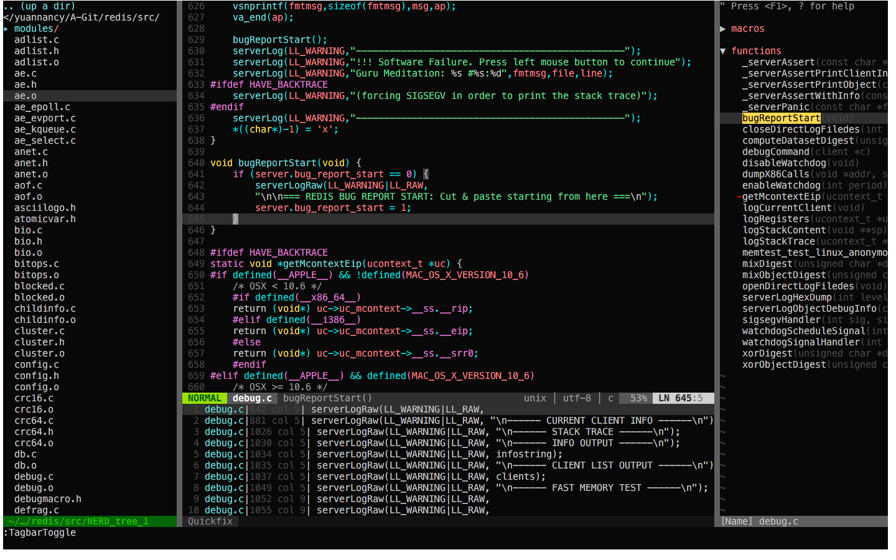

# screenshot


# VIM Installation
(Supported Ubuntu/Centos/Mac OS)

```bash
git clone https://github.com/githubmota/vim.git
cd ./vim; ./install.sh
```

PS: If the target machine has no available network, you can just copy _vimrc_base file to your user path, not forget rename it to _vimrc, this file remove all the plugins should be downloaded, but you still need vim had been installed in the target machine.

# ChangeLog
- 2017/05/23: Add [markdown-preview.vim](https://github.com/iamcco/markdown-preview.vim) support.

# Tips
- `F2` key to open the directory files browser.
- `F3` key to open `Source Insight`.
- `F6` key to optimize the code format.
- `F7` key to open markdown preview window and `F9` key to close.
(Make sure `g:mkdp_path_to_chrome` in `_vimrc` file set to the browser exists.)
- `F9` key to compile/link/run the source code.
- More need to look into the `_vimrc` file.
